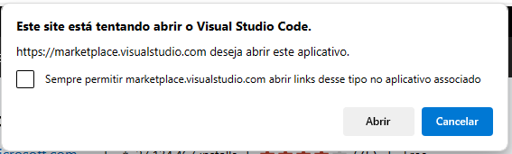
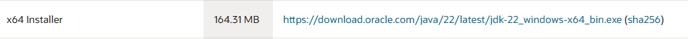
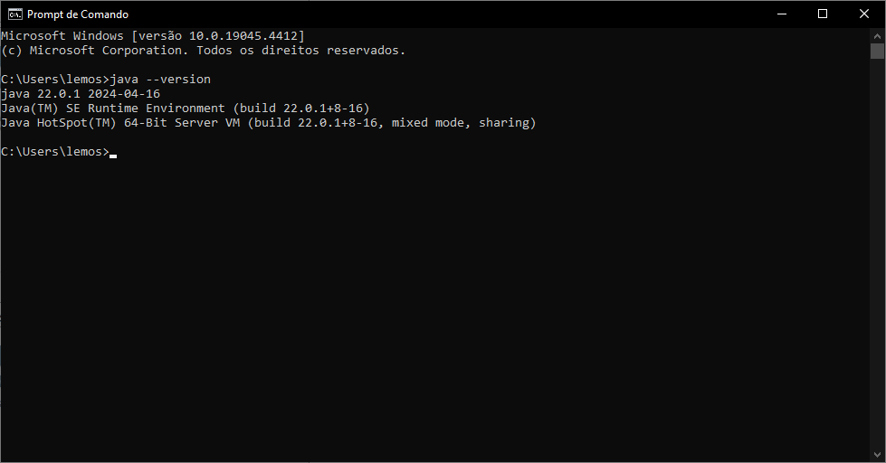
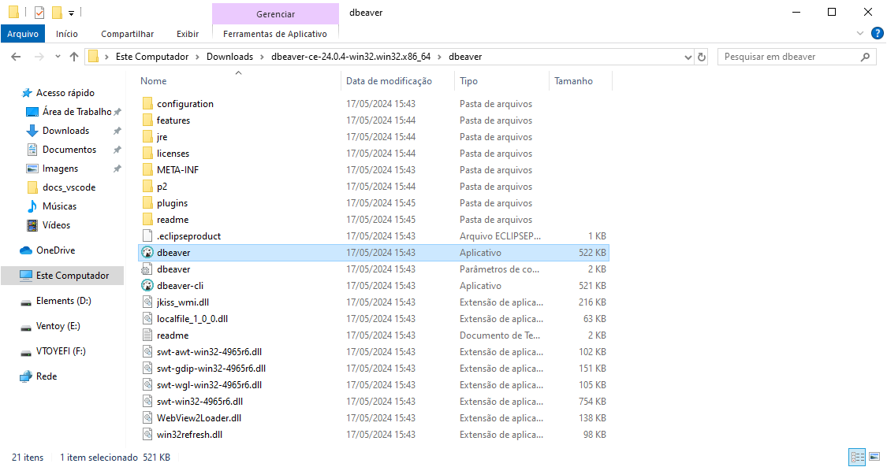
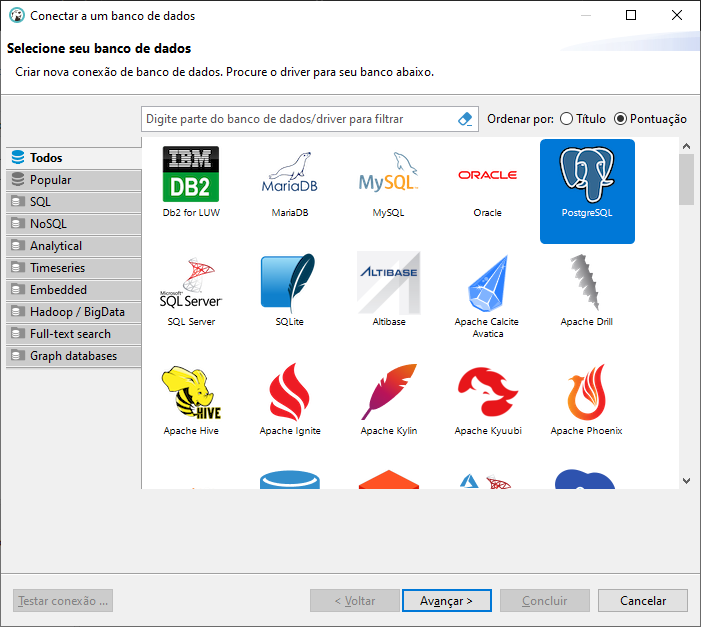
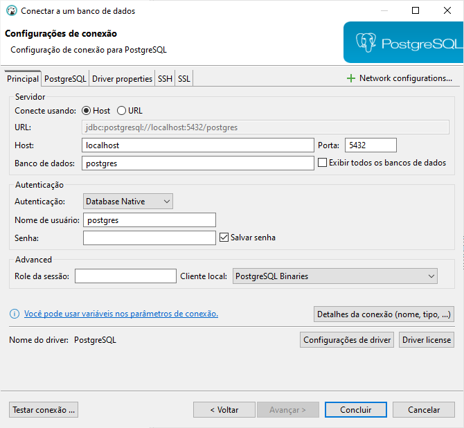
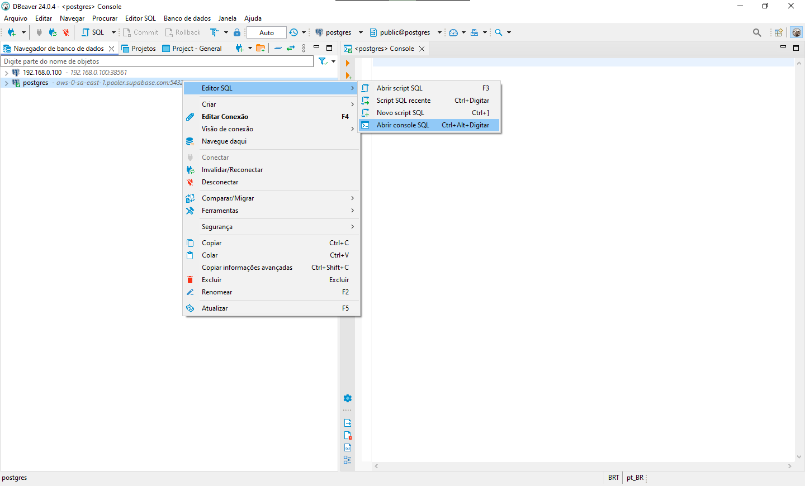

# Manual de Instalação

### Programas necessários para o funcionamento do projeto
- [Visual Studio Code]
- [Java Development Kit]
- [DBeaver]

### Visual Studio Code
#### Passos para instalar o **Visual Studio Code**
1. Primeiro passo, baixe o instalador do [Visual Studio Code](https://code.visualstudio.com/Download) no seguinte link "<em>https://code.visualstudio.com/Download</em>"
2. Abra o arquivo que você acabou de baixar
3. Aceite o **acordo de licença** e clique em **Próximo**

    

4. Clique em **Próximo** e logo após clique em **Instalar**

    

    

5. Por fim, só clique em **Concluir**

    

6. Esta é a tela inicial do Visual Studio Code.

    

7. Agora, vamos baixar as [extensões](https://marketplace.visualstudio.com/items?itemName=vscjava.vscode-java-pack) do Java para o Visual Studio Code. Utilize o link "<em>https://marketplace.visualstudio.com/items?itemName=vscjava.vscode-java-pack</em>" para o site com o pack de extensões
8. Clique em . Se a seguinte mensagem aparecer:

    

    Basta clicar em continuar.

    

    Abra com o Visual Studio Code.

    

9. Agora é só clicar em **Install** e aguardar.

### Java Development Kit
#### Passos para instalar o **Java Development Kit**
1. Primeiro passo, baixe o instalador do [Java Development Kit](https://www.oracle.com/br/java/technologies/downloads/#jdk22-windows) no seguinte link "<em>https://www.oracle.com/br/java/technologies/downloads/#jdk22-windows</em>"

    

    Utilize a versão installer para os próximos passos.
2. Vá clicando em **Next** até que a instalação se inicie

    

    

3. Clique em **Close** para finalizar a instalação

    

#### Verificação da instalação
4. Abra o Prompt de comando e coloque o seguinte código `java --version`. Se a seguinte tela aparecer, significa que o Java foi instalado corretamente

    

### DBeaver Community
#### Passos para instalar o **DBeaver Community**
> Para este projeto, vamos utilizar o DBeaver para manipular o banco de dados.

1. Vamos baixar a versão portátil do [DBeaver](https://dbeaver.io/download/) no seguinte link "<em>https://dbeaver.io/download/</em>"
2. No site do DBeaver, clique em  para fazer o download do portátil.
3. Quando o download concluir, localize o diretório do arquivo e extraia-o.

    

4. Abra a pasta que você acabou de extrair e localize o arquivo dbeaver e abra-o

    

5. Clique em não

    

6. Clique em Postgres e clique em Avançar

    

7. Utilize os dados abaixo para preencher os campos de conexão e depois clique em concluir
    - **host:** aws-0-sa-east-1.pooler.supabase.com
    - **banco:** postgres
    - **usuário:** postgres.gwciqljtnkhyojnomxbm
    - **senha:** )?)PRzkRi~7KxKs

    

8. Faça o download de todos os requisitos

    

#### Teste de Conexão
9. Agora, vamos fazer um teste. Abra um novo console e digite `SELECT 1+1` e depois execute-o clicando em 

    

10. Se você receber um resultado igual ao da imagem abaixo, está tudo nos conformes

    

---

### Informações Adicionais
- Arquivo `.properties` que formata locais de usabilidade do escopo
- Repositório onde pode ser alterado o caminho do projeto, fazendo com que seja renderizada outra tela
- Alteração no HTML
- Mudança de escopo de busca em Java e JavaScript
