<body>
        

            <fieldset>
                <legend>Programas necessarios para o funcionamendo do projeto</legend>
                <ul>
                    <li><a href="#VSCODE">Visual Studio Code</a></li>
                    <li><a href="#JDK">Java Developement Kit</a></li>
                    <li><a href="#DBEAVER">DBeaver</a></li>
                </ul>
            </fieldset>
        

            <fieldset class="installer" id="VSCODE">
                <legend>Visual Studio Code</legend>
                
Passos para instalar o <b>Visual Studio Code</b>

                <ul>
                    <li>Primeiro passo baixe o instalador do <a href="https://code.visualstudio.com/Download">Visual Studio Code</a> no seguinte link "<em>https://code.visualstudio.com/Download</em>"</li>
                    <li>Abra o arquivo que você acabou de baixar</li>
                    <li>Aceite o <b>acordo de licença</b> e Clique em <b>Próximo</b> </li>
                     
                    
                        
                    
                     
                    <li>Clique em <b>Proxímo</b> e logo após clique em <b>instalar</b></li>
                     
                    
                        
                    
                     
                     
                    
                        
                    
                     
                    <li>Por fim só clique em <b>Concluir</b></li>
                     
                    
                        
                    
                     
					<li>Esta é a tela inicial do Visual Studio Code.</li>
                    
                        
                    
					 
					<li>Agora vamos baixar as <a href="https://marketplace.visualstudio.com/items?itemName=vscjava.vscode-java-pack">extensões</a> do java para o Visual Studio Code.</li>
                        
Ultilize o link "<em>https://marketplace.visualstudio.com/items?itemName=vscjava.vscode-java-pack</em>" para o site com o pack de extensões

                    <li>clique em 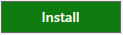. se a segunite mensagem aparecer</li>
                    
                        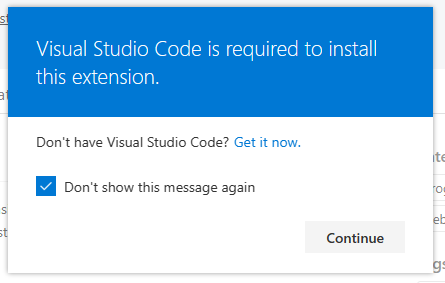
                    
                    
basta clicar em continuar

                    
                    
                        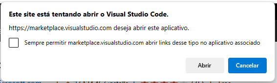
                    
                    
abra com o Visual studio code

                    
                    
                        
                    
                    <li>agora é só clicar em <b>install</b> e aguardar</li>
                </ul>
            </fieldset>

             

            <fieldset class="installer" id="JDK">
                <legend>Java Developement Kit</legend>
                <ul>
                    
Passos para instalar o <b>Java Developement Kit</b>

                    <li>Primeiro passo baixe o instalador do <a href="https://www.oracle.com/br/java/technologies/downloads/#jdk22-windows">Java Developement Kit</a> no seginte link "<em>https://www.oracle.com/br/java/technologies/downloads/#jdk22-windows</em>"</li>
                    
                        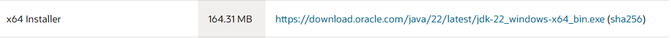
                    
                    
Ultilize a versão installer para os proximos passos

                    <li>Vá clicando em <b>Next</b> até que a instalação se inicie</li>
                     
                    
                        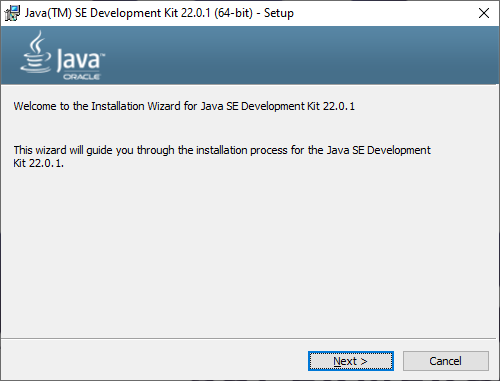
                    
                     
                    
                        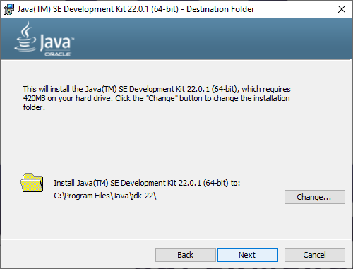
                    
                     
                    <li>Clique em <b>Close</b> para finalizar a instalação</li>
                     
                    
                        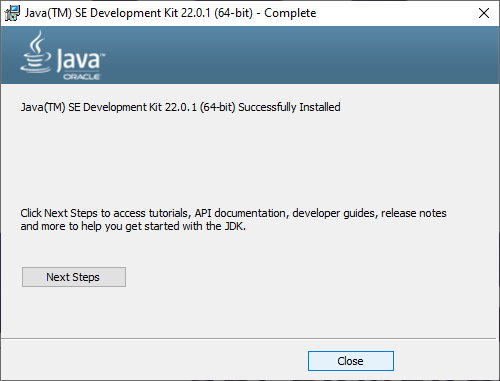
                    
                     
                    <b>Agora vamos verificar se a instalação foi efetuada com sucesso</b>
                    <li>Abra o Prompt de comando e coloque o seguinte codigo <code class="cmd">java --version</code> se a seguinte tela aparece seguinifica que o java foi instalado corretamente</li>
                     
                    
                        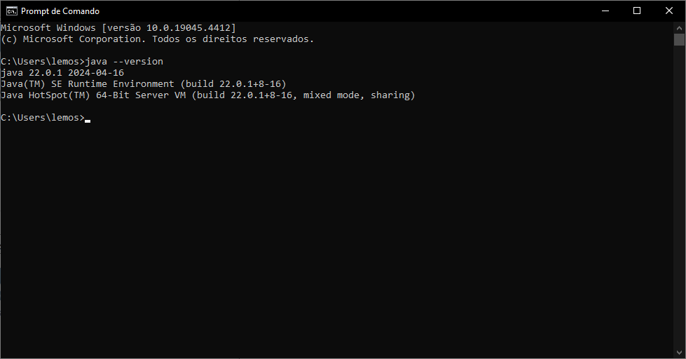
                    
                </ul>
            </fieldset>

             

            <fieldset class="installer" id="DBEAVER">
                <legend>DBeaver Community</legend>
                <ul>
                    
Passos para instalar o <b>DBeaver Community</b>

                    <mark>Para este projeto vamos ultiliza o DBeaver para manipular o banco de dados</mark>
                    <li>Vamos baixar a versão portátil do <a href="https://dbeaver.io/download/">DBeaver</a> no seguinte link "<em>https://dbeaver.io/download/</em>"</li>
                    <li>No site do DBeaver você vai clicar em 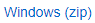 para fazer um download do portátil.</li>
                    <li>Quando o download concluir, localize o diretorio do arquivo e extraia ele.</li>
                    
                        
                    
                    <li>Abra a pasta que você acabou de extrair e localize pelo arquivo dbeaver e abra-o</li>
                    
                        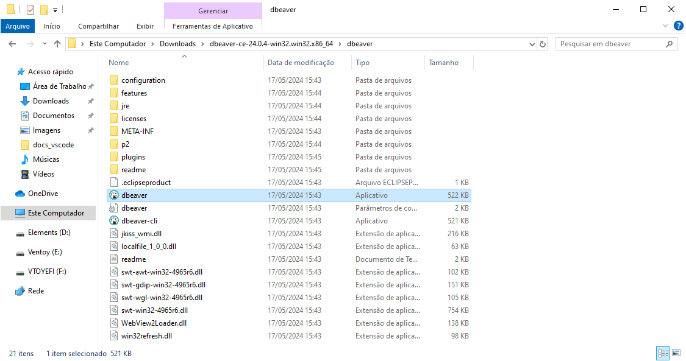
                    
                    <li>Clique em não</li>
                    
                        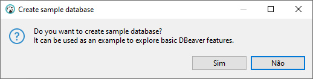
                    
                    <li>Clique em Postgres e clique em Avancar</li>
                    
                        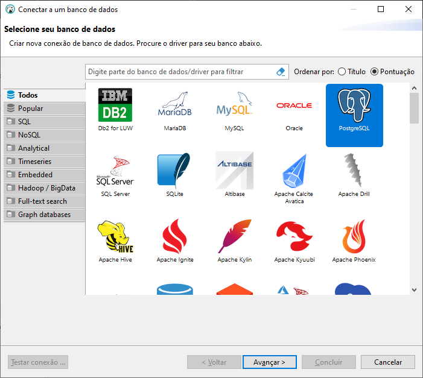
                    
                    <li>Ulitlize os dados abaixos para preencher os campos de conexão e depois clique em concluir</li>
                    
host: aws-0-sa-east-1.pooler.supabase.com

                    
banco: postgres

                    
usuario: postgres.gwciqljtnkhyojnomxbm

                    
senha: )?)PRzkRi~7KxKs

                    
                        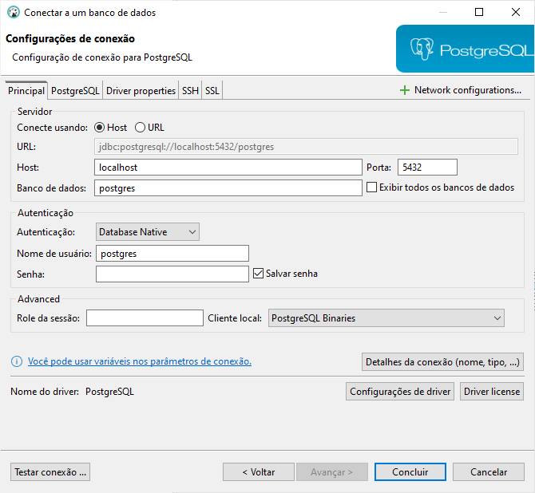
                    
                    <li>Faça o downloads de todos requisitos</li>
                    
                        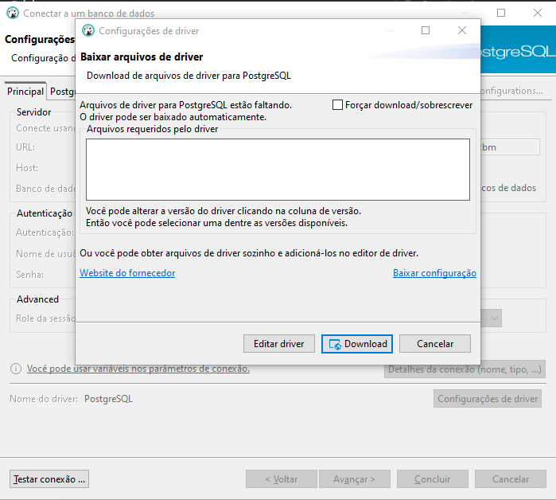
                    
                    <li>Agora vamos fazer um teste, abra um novo console e digite <code>SELECT 1+1</code> e depois execute-o clicando em </li>
                    
                        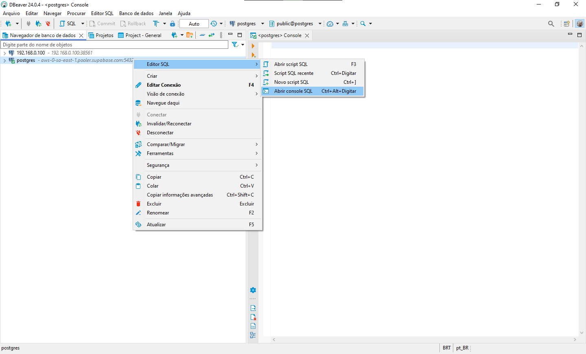
                    
                    <li>Se voce receber um resultado igual o da imagem abaixo e esta tudo nos conformes</li>
                    
                        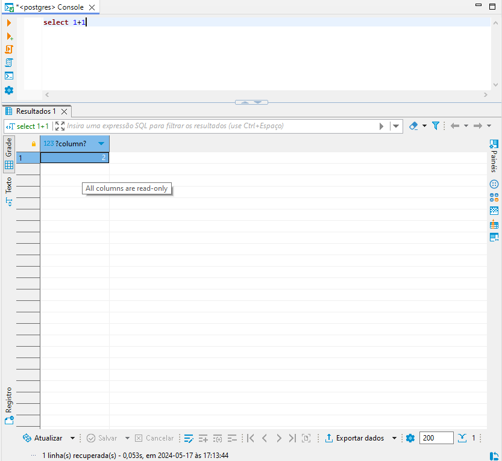
                    
                </ul>
            </fieldset>
            
        

        

            stating_project ...
        

        

            test_function ...
        

        

            <ul>
                <li>arquivo .proprierts que formata locais de usabilidade do scopo</li>
                <li>repositore onde pode ser alterado caminho do projeto fazendo com que seja renderizando outra tela</li>
                <li>alteração no html</li>
                <li>Mudança de scopo de busca em java e javascript</li>
            </ul>
        

    </body>
